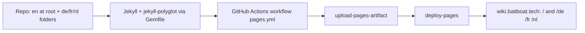

# Requirements

### Overview & Goals
The BBT wiki (a Jekyll + `just-the-docs` site on GitHub Pages at `wiki.baitboat.tech`) is English-only today. The goal is to add multilanguage support using the standard Jekyll i18n solution (**jekyll-polyglot**) for English (default), German, Dutch, and French, while keeping the site hosted on GitHub Pages.

### Scope
**In Scope**
- Switching the GitHub Pages build source to the officially-supported **GitHub Actions** build (required because jekyll-polyglot is not on the Pages plugin whitelist — verified against `https://pages.github.com/versions/`).
- Adding a `Gemfile` and a deploy workflow that builds Jekyll with `jekyll-polyglot`.
- Configuring polyglot in `_config.yml` (languages, default lang, localization exclusions).
- Tagging all existing English pages with `lang: en` and keeping English served at the site root (minimal URL breakage).
- Creating translated content trees under `/de/`, `/fr/`, `/nl/` mirroring the English structure.
- A language switcher in the just-the-docs nav footer.

**Out of Scope**
- Ongoing translation maintenance workflow beyond the initial setup.
- Changing the custom domain or theme.
- Translating the `CNAME` / shared `assets/` (they are excluded from localization).

### Prerequisite / User Action
The implementing agent can add all files, but flipping **Settings → Pages → Source** from *Deploy from a branch* to *GitHub Actions* is a one-time manual step in the GitHub UI that only the repo owner can perform.

### User Stories
- As a German/Dutch/French-speaking angler, I want the wiki in my language so I can follow the baitboat setup guides.
- As a returning English visitor, my existing links keep working because English stays at the root.
- As any visitor, I can switch language from any page via a visible language switcher.

### Non-Functional Requirements
- Build must remain reproducible via the committed `Gemfile` and workflow.
- English URLs (`/`, `/Maps/...`, `/Waypoints`, `/Import And Export`, `/Voice & Speech/...`) must not change.
- Translated content under `/de/`, `/fr/`, `/nl/` must render with correct sidebar nav and working assets.

# Technical Design

### Current Implementation
- Jekyll site, `remote_theme: just-the-docs/just-the-docs`, default GitHub Pages "deploy from branch" build.
- `_config.yml`: title, `url`, `baseurl: ""`, `plugins: [jekyll-include-cache, jekyll-seo-tag]`, just-the-docs config (search, nav, aux_links).
- Content at root (`index.md`, `Waypoints.md`, `Import And Export.md`) and in `Maps/` and `Voice & Speech/`, using just-the-docs front matter (`nav_order`, `parent`, `has_children`).
- No `Gemfile`, no `.github/` workflows present.
- `CNAME` sets the custom domain; `assets/` holds logo + screenshots.

### Key Decisions
1. **Use jekyll-polyglot** — the standard Jekyll i18n plugin (auto-generates per-language URLs, relativizes links, supports a language switcher). Confirmed it is **not** whitelisted by GitHub Pages, so it requires the GitHub Actions build.
2. **Switch Pages Source to GitHub Actions** — officially supported by GitHub (`actions/configure-pages`, `actions/upload-pages-artifact`, `actions/deploy-pages`). Bypasses the plugin whitelist; we control the `Gemfile`.
3. **Keep English at root (`default_lang: en`)** — minimizes broken existing links. Translations live in `/de/`, `/fr/`, `/nl/` folders mirroring the structure.
4. **Per-language nav via mirrored front matter** — each translated page carries the same `nav_order`/`parent`/`has_children`; polyglot scopes the collection per language so the just-the-docs sidebar shows only the active language.
5. **Language switcher in `nav_footer_custom`** — just-the-docs provides a `_includes/nav_footer_custom.html` hook, the idiomatic place for the switcher.

### Proposed Changes
- **New `Gemfile`**: `jekyll` (~> 4.3), `jekyll-remote-theme`, `jekyll-include-cache`, `jekyll-seo-tag`, `jekyll-polyglot`, `webrick`.
- **New `.github/workflows/pages.yml`**: checkout → `ruby/setup-ruby` (bundler-cache) → `bundle exec jekyll build` (`JEKYLL_ENV=production`) → `configure-pages` → `upload-pages-artifact` → `deploy-pages`. Requires `permissions: pages: write, id-token: write` and `concurrency: group: pages`.
- **Modified `_config.yml`**: add `jekyll-polyglot` to `plugins:`, and a polyglot block:
  ```yaml
  languages: ["en", "de", "fr", "nl"]
  default_lang: "en"
  exclude_from_localization: ["assets", "CNAME", "_config.yml"]
  ```
  (plus polyglot's documented `langsep` / `i18n_headers` usage as needed).
- **Modified English pages**: add `lang: en` to front matter of all 8 `.md` files; standardize shared-asset and internal links to leading-slash absolute paths (e.g. `/assets/dialog_waypoint_options.png`, `/Maps/Offline%20Maps.html`) so they resolve under language prefixes.
- **New `_data/lang_names.yml`**: `en: English`, `de: Deutsch`, `fr: Français`, `nl: Nederlands`.
- **New `_includes/nav_footer_custom.html`**: language switcher built from the jekyll-polyglot documented snippet (iterate `site.languages`, link each language's equivalent page via `site.active_lang`/`site.default_lang`, display names from `lang_names`).
- **New translation trees**: `de/`, `fr/`, `nl/` mirroring root + `Maps/` + `Voice & Speech/`, each file translated with `lang:` front matter and mirrored nav front matter.

### File Structure (new/modified)
```
Gemfile                                  (new)
.github/workflows/pages.yml               (new)
_config.yml                               (modified: polyglot + plugins)
_data/lang_names.yml                      (new)
_includes/nav_footer_custom.html          (new)
index.md, Waypoints.md, Import And Export.md   (modified: lang: en, abs links)
Maps/*.md, Voice & Speech/*.md                 (modified: lang: en, abs links)
de/**, fr/**, nl/**                       (new: translated content trees)
```

### Architecture Diagram


### Risks
- **just-the-docs nav/search across languages**: polyglot should scope the page collection per language so the sidebar/search only show the active language; must be verified — mitigation: add a `lang`-based filter in nav if leakage occurs.
- **Asset/internal links under language prefixes**: relative links like `assets/dialog_waypoint_options.png` break under `/de/`. Mitigation: standardize to leading-slash absolute paths and verify polyglot relativization.
- **Missing translations**: pages without a translation must degrade gracefully in the switcher (polyglot default behavior).
- **Manual GitHub UI step**: the Pages Source switch is out-of-repo and owner-only.

# Testing

### Validation Approach
- Primary signal: the `.github/workflows/pages.yml` run goes green and deploys.
- Local verification: `bundle exec jekyll build` and inspect `_site/` for per-language output.

### Key Scenarios
- English site still renders at root (`/`, `/Maps/Offline%20Maps.html`, `/Waypoints`) with unchanged URLs.
- `/de/`, `/fr/`, `/nl/` each render their translated index and child pages.
- Language switcher on a page links to the same page in every available language.
- Sidebar (just-the-docs nav) shows only the active language's pages.
- Images/assets load correctly under each language prefix.

### Edge Cases
- A page with no translation in a language: switcher handles gracefully (links to default or hides).
- Spaces in filenames (e.g. `Voice & Speech`, `Offline Maps`) remain correctly encoded across languages.
- just-the-docs search index scoped per language (verify no cross-language search hits).

# Delivery Steps

### ✓ Step 1: Switch GitHub Pages build to GitHub Actions with Gemfile and deploy workflow
The site builds and deploys via a custom GitHub Actions workflow that can load jekyll-polyglot, replacing the default Pages one-click build.

- Add a `Gemfile` listing `jekyll` (~> 4.3), `jekyll-remote-theme`, `jekyll-include-cache`, `jekyll-seo-tag`, `jekyll-polyglot`, and `webrick`.
- Add `.github/workflows/pages.yml` using `actions/checkout`, `ruby/setup-ruby` (bundler-cache), a `bundle exec jekyll build` step with `JEKYLL_ENV=production`, then `actions/configure-pages` + `actions/upload-pages-artifact` + `actions/deploy-pages`.
- Set workflow `permissions: pages: write, id-token: write` and a `concurrency: group: pages` block.
- Keep `remote_theme: just-the-docs/just-the-docs` in `_config.yml` so the theme source is unchanged.
- User-only prerequisite (cannot be done via file edits): in repo Settings → Pages, set Source to "GitHub Actions".
- Verify the workflow runs green and the existing English site still deploys at the custom domain before adding i18n logic.

### ✓ Step 2: Configure jekyll-polyglot and tag all English pages with lang front matter
jekyll-polyglot is configured and active, with English as the default language served at the site root.

- Add a polyglot block to `_config.yml`: `languages: ["en", "de", "fr", "nl"]`, `default_lang: "en"`, `exclude_from_localization: ["assets", "CNAME", "_config.yml"]`, plus `langsep`/`i18n_headers` as documented by jekyll-polyglot.
- Add `jekyll-polyglot` to the `plugins:` list in `_config.yml`.
- Add `lang: en` front matter to every existing English page: `index.md`, `Waypoints.md`, `Import And Export.md`, `Maps/index.md`, `Maps/Offline Maps.md`, `Maps/Bathymetric Depth Maps.md`, `Voice & Speech/index.md`, `Voice & Speech/The Voice Assistant.md`.
- Add `_data/lang_names.yml` mapping codes to display names (English, Deutsch, Français, Nederlands).
- Standardize shared-asset and internal links in English pages to leading-slash absolute paths (e.g. `/assets/dialog_waypoint_options.png`, `/Maps/Offline%20Maps.html`) so they resolve correctly under language prefixes.
- Verify `bundle exec jekyll build` succeeds and English still renders at root.

### ✓ Step 3: Create translated content trees for German, Dutch, and French
German, Dutch, and French versions of every page exist under language folders, mirroring the English structure and navigation.

- Create `de/`, `fr/`, `nl/` folders mirroring the root + `Maps/` + `Voice & Speech/` layout (e.g. `de/index.md`, `de/Waypoints.md`, `de/Maps/index.md`, `de/Maps/Offline Maps.md`, `de/Voice & Speech/The Voice Assistant.md`, etc.).
- Translate the content of each page into the target language.
- Mirror the just-the-docs front matter (`nav_order`, `parent`, `has_children`, `title`) on each translated page and set `lang: <code>`.
- Use leading-slash absolute paths for assets/internal links in translated pages (same convention as English).
- Verify each language tree builds and renders at `/de/`, `/fr/`, `/nl/`.

### ✓ Step 4: Add language switcher and verify per-language navigation and search
Visitors can switch languages from any page, and the sidebar/search behave per language.

- Add `_includes/nav_footer_custom.html` implementing the jekyll-polyglot documented language-switcher snippet, iterating `site.languages` and linking to the equivalent page per language using `site.active_lang`/`site.default_lang`, with display names from `_data/lang_names.yml`.
- Confirm the just-the-docs sidebar shows only the current language's pages (polyglot scopes the collection per language); if it leaks across languages, add a `lang`-based filter.
- Confirm just-the-docs search (`search_enabled: true`) indexes only the active language.
- Handle the missing-translation case gracefully (polyglot behavior for untranslated pages).
- Run a full build and verify: root (en) + `/de/` + `/fr/` + `/nl/` render, switcher links resolve, images/assets load under each prefix, and the GitHub Actions workflow deploys successfully.y.