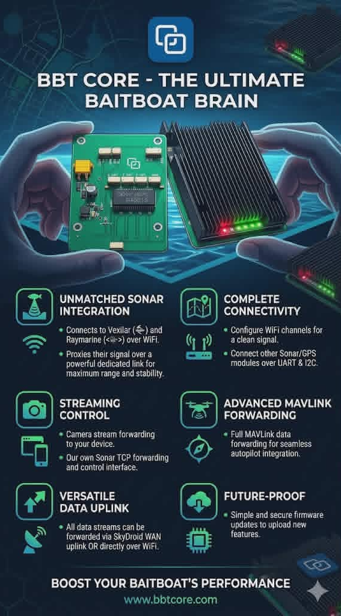
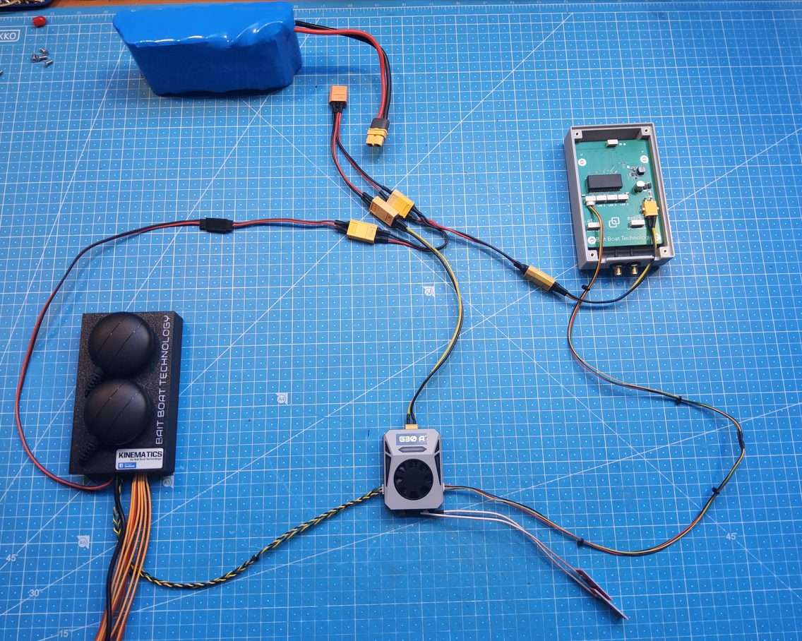
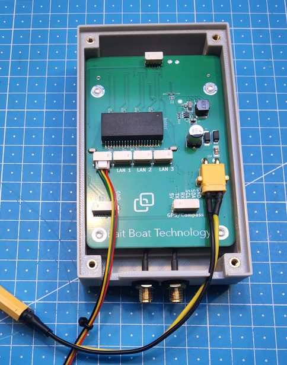
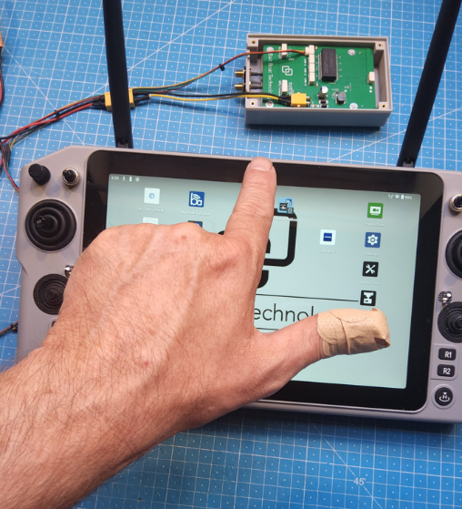
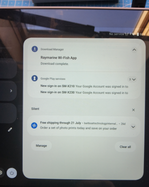
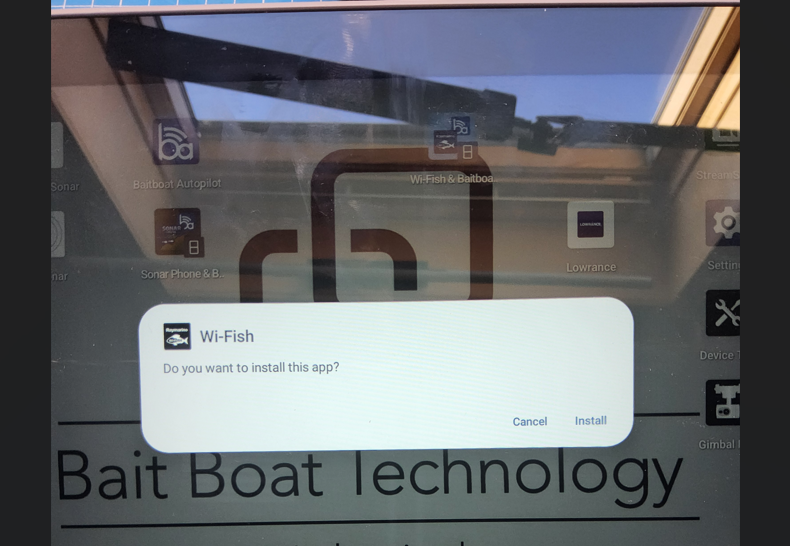
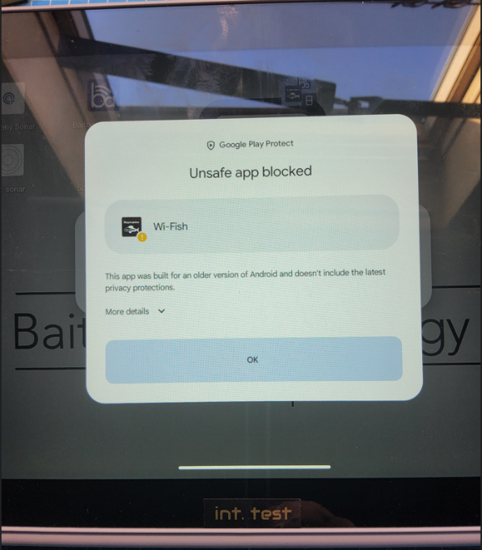
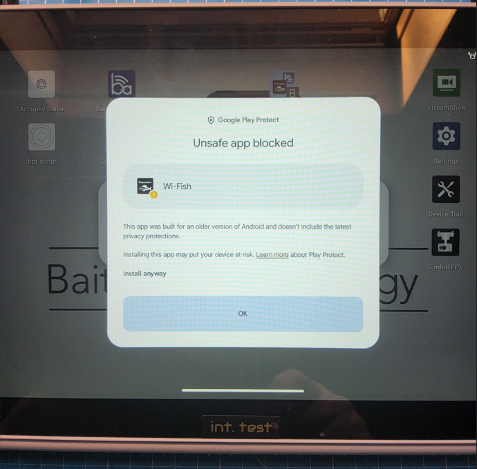
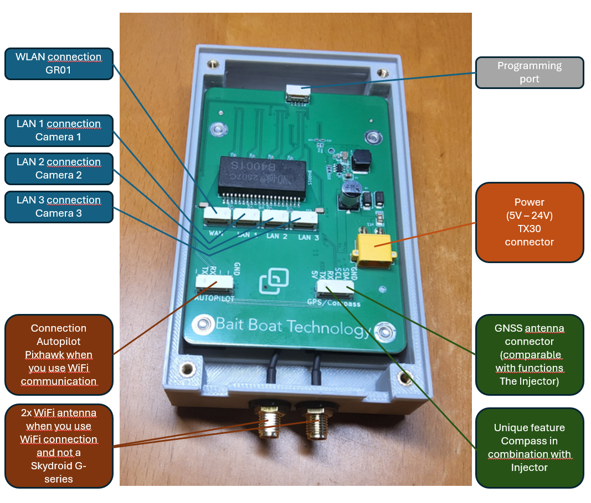

# BBT Core Installation and Pairing

*User Manual for Installation, Pairing and Use*

**BBT Core – The Ultimate Baitboat Brain.** A practical guide for connecting the BBT Core, pairing it with Raymarine, installing the WiFish app and using it in practice.

> **Important:** whenever BBT Core settings are changed, the BBT Core must be restarted for the changes to take effect.

## Table of Contents

- [1. Connecting the BBT Core](#1-connecting-the-bbt-core)
- [2. Removing the standard Wi-Fish app (if installed)](#2-removing-standard-wi-fish-app-if-installed)
- [3. Pairing the BBT Core with Raymarine](#3-pairing-the-bbt-core-with-raymarine)
- [4. Downloading the Special Wi-Fish App](#4-downloading-the-special-wi-fish-app)
- [5. Use](#5-use)
- [6. Overview of Other Connections](#6-overview-of-other-connections)
- [7. Builder Mode via Service Code](#7-builder-mode-via-service-code)
- [8. Checklist for Boatbuilders](#8-checklist-for-boatbuilders)

## 1. Connecting the BBT Core

1. Connect the 5 to 24V power supply.
2. Connect the **WAN** output of the BBT Core to the **LAN** input of the Skydroid GR01.

## 2. Removing standard Wi-Fish app (if installed)

1. Open **Settings**.
2. Go to **Apps**.
3. Select the **WiFish app**.
4. Tap **Remove**.

## 3. Pairing the BBT Core with Raymarine

1. Open the **BaitBoat Autopilot** app.
2. Under **Help**, check that you are using at least version 1.470.
3. Check that you are connected via **Skydroid Connect**.
4. Go to **Boat Setup**.
5. Go to **BBT Core**.
6. Tick the checkbox for **Skydroid G-Series**.
7. Set **Transmit Power** to **1 dB**.
8. Go to **Pair WiFi Device**.
9. Find **Raymarine** and click it.
10. Enter the password and confirm.
11. Click **NEXT**.
12. Wait until you receive the message that the configuration has been completed successfully.
13. Click **CLOSE**.
14. Restart everything: both the BBT Core and the Skydroid handheld transmitter.

## 4. Downloading the Special Wi-Fish App

1. Check that you are connected to the internet.
2. Start the **BaitBoat Autopilot** app.
3. Go to **Boat Set-up**.
4. Select **BBT Core**.
5. Click **Install WiFish App**.
6. Click **INSTALL**.
7. Swipe down from the top of the screen, starting in the middle of the screen.

8. Tap **Download complete**.

9. Click **Install**.

10. Select **More details**.

11. Click **Install anyway**.

12. Close the Raymarine app.

The installation is complete.

> **Note:** after changing BBT Core settings, restart the BBT Core.

## 5. Use

> **Note:** during initial use, the Raymarine connection may briefly drop a few times. In most cases, the connection will automatically be restored within one second. This happens because the Skydroid protocol automatically searches for the most suitable bandwidth. During this search, the connection may be interrupted temporarily. Wait calmly until the connection remains stable.

## 6. Overview of Other Connections

> **Note:** Compass connection and calibration are still under development.

- Camera connections are functioning.
- WiFi communication is functioning.
- GPS antenna connection is functioning.
- Compass is still under development.

## 7. Builder Mode via Service Code

When setting up the BBT Core, the tablet or Skydroid sometimes does not contain the builder's account (for example on a freshly configured device). In that case you can still unlock **full builder mode** with a service code.

1. Open the **BaitBoat Autopilot** app.
2. Go to the **Help/Feedback** tab.
3. Tap **Service Code**.
4. Enter the service code and confirm.

A valid service code unlocks full builder mode (Real Builder). Service codes are provided by Baitboat — contact us to request one. Builders can also view today's service code in the app: it is shown below the **Service Code** button while builder mode is active.

> **Note:** restart the BBT Core after unlocking builder mode.

## 8. Checklist for Boatbuilders

Run through this checklist before handing a Skydroid-equipped boat to the customer.

1. **Wiring** — BBT Core power connected (5–24 V) and the BBT Core **WAN** output wired to the **LAN** input of the Skydroid GR01.
2. **Pairing** — BBT Core paired with Raymarine (see section 3): **Skydroid G-Series** ticked, **Transmit Power** at 1 dB, and both the BBT Core and the Skydroid handheld restarted afterwards.
3. **Wi-Fish app** — the special Wi-Fish app installed via **Boat Setup → BBT Core → Install WiFish App** (see section 4).
4. **Steering test** — with the boat on a stand, drive each motor briefly with the Skydroid sticks and confirm the direction and the rudder response are correct for this boat (see the [Ardupilot motor and servo test guide](https://ardupilot.org/rover/docs/rover-motor-and-servo-configuration.html#rover-motor-and-servo-configuration-testing)). On twin-motor boats, check both motors.
5. **Connection check** — leave the boat connected for a few minutes and confirm the **Skydroid Connect** link stays stable (a few brief drops in the first minutes are normal — see section 5).
6. **Builder mode** — if the device lacks the builder's account, unlock it with a service code (see section 7), and hand the boat over in customer mode afterwards.
7. **Final restart** — restart the BBT Core and the Skydroid one last time and verify the boat connects immediately.

When everything ticks off, the boat is ready for the customer.
