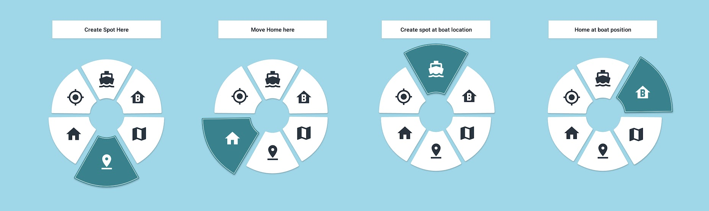

# Waypoints Guide

## Introduction

Welcome to the Waypoints feature of your Baitboats app! This guide will help you understand how to create, manage, and navigate to waypoints (also called "spots") on the water. Waypoints are marked locations that you can save and return to later, making it easier to find your favorite fishing spots.

## Table of Contents

- [Introduction](#introduction)
- [Creating Waypoints](#creating-waypoints)
   - [Method 1: Creating waypoints through the quick access dialog](#method-1-creating-waypoints-through-the-quick-access-dialog)
   - [Method 2: Using the add waypoint button](#method-2-using-the-add-waypoint-button)
   - [Method 3: switch on handset](#method-3-switch-on-handset)
   - [Method 4: Voice Assistant](#method-4-voice-assistant)
- [Managing Your Waypoints](#managing-your-waypoints)
   - [Viewing Your Waypoints](#viewing-your-waypoints)
   - [Renaming a Waypoint](#renaming-a-waypoint)
   - [Setting a Waypoint Number](#setting-a-waypoint-number)
   - [Deleting a Waypoint](#deleting-a-waypoint)
   - [Moving a waypoint](#moving-a-waypoint)
- [Navigating to Waypoints](#navigating-to-waypoints)
   - [Activating a Waypoint](#activating-a-waypoint)
   - [Using "Go Now"](#using-go-now)
   - [When You Reach a Waypoint](#when-you-reach-a-waypoint)
- [Customizing Waypoints](#customizing-waypoints)
   - [Setting Icons for All Waypoints](#setting-icons-for-all-waypoints)
   - [Setting Icon for One Waypoint](#setting-icon-for-one-waypoint)
- [Tips for Using Waypoints](#tips-for-using-waypoints)
- [Troubleshooting](#troubleshooting)

## Creating Waypoints

There are several ways to create waypoints in your Baitboats app:

### Method 1: Creating waypoints through the quick access dialog

1. Press and hold anywhere on the map to summon the quick option dialog
2. While holding your finger down select one of the waypoint options

- **Bottom**: Create spot at the position of your finger
- **Bottom left**: Move the home spot to the position of your finger
- **Top**: Create spot at the current boat position
- **Top right**: Move your home spot to the current boat position

The app will automatically assign a name and number to your waypoint

### Method 2: Using the add waypoint button

1. On the bottom right you can tap the waypoint icon with a `+` sign
2. You'll be presented with three options
   1. **Boat location**: Create the waypoint at the current boat location.
   2. **Location on map**: You can now scroll the map then press the checkbox on the top left.
   3. **My location**: You'll have to give permission first, then the waypoint will be create to your location

## Method 3: switch on handset

If your handset is configured like this you can create a waypoint on the handset to have it show up in the app.
Usually the switch on the topright is configured to create waypoints.

## Method 4: Voice Assistant

More info on the [Voice Assistant Page](/Voice%20&%20Speech/The%20Voice%20Assistant.html) 

## Managing Your Waypoints

### Viewing Your Waypoints

1. All your waypoints are visible on the map as colored markers
2. You can also see a list of your waypoints by tapping the waypoints dropdown menu at the top of the screen
3. Zooming out will create stacks of nearby waypoints, the number will then represent the number of combined waypoints.

### Renaming a Waypoint

1. Tap on the waypoint marker on the map
2. Press the dot dot dot icon on the top right of the waypoint dialog
3. Select "Rename" from the popup menu
4. Enter the new name
5. Tap "Save"

### Setting a Waypoint Number

Each waypoint has a unique number that appears on its icon. To change this number:

1. Tap on the waypoint marker on the map
2. Select "Set Number" from the waypoint dialog
3. Scroll to the new number
4. Tap "Save"

### Deleting a Waypoint

1. Tap on the waypoint marker on the map
2. Press the dot dot dot icon on the top right of the waypoint dialog
3. Select "Delete" from the popup menu
4. Confirm the deletion

### Moving a waypoint

1. Tap on the waypoint marker on the map
2. Press the dot dot dot icon on the top right of the waypoint dialog
3. Select "Move" from the popup menu
4. Select one of the [move options](#method-2-using-the-add-waypoint-button)

Alternatively, you can enable dragging from settings -> App behavior.
After this you can long press a spot to drag it.

## Navigating to Waypoints

### Activating a Waypoint

When you activate a waypoint, your boat will know where to go when `Auto` is enabled:

1. Tap on the waypoint marker on the map
2. Select "Activate" from the waypoint dialog

The boat will move to the selected waypoint once you switch to auto mode.
This can be done from the app or with a switch on your handset.

### Using "Go Now"

The "Go Now" feature makes your boat immediately start moving toward the selected waypoint:

1. Tap on the waypoint marker on the map
2. Select "Go Now" from the popup menu
3. Your boat will automatically switch to AUTO mode and start navigating to the waypoint

> **Note**: This will only work when your boat is connected to the app.

### When You Reach a Waypoint

You can set what happens when your boat reaches a waypoint:

1. Go to the Settings tab
2. Find "When arriving at waypoint"
3. Choose one of the options:
   - **Manual**: The boat stops and waits for your next command
   - **Hold Position**: The boat stays at the waypoint location
   - **Loiter**: The boat will actively fight against currents and constantly loop back if you drift of

## Customizing Waypoints

### Setting Icons for All Waypoints

To change the default icon used for all waypoints:

1. Go to the Settings tab
2. Tap Appearance
3. Tap "Spot Icons"
4. Choose from the available icon styles
5. Tap "Save"

### Setting Icon for One Waypoint

To give a specific waypoint a unique icon:

1. Tap on the waypoint marker on the map
2. Tap the icon from the waypoint dialog
3. Choose from the available icon styles
4. Tap "Ok"

Different icon colors can help you categorize your waypoints (e.g., yellow for shallow spots, red for deep spots).

## Tips for Using Waypoints

- **Name your waypoints descriptively**: Instead of "Spot 1," use names like "Deep Drop-off" or "North Reed"
- **Use different icon colors** to categorize different types of fishing spots
- **Set waypoint numbers** in a logical sequence if you plan to visit multiple spots in order
- **Export your waypoints** regularly as a backup (Settings > Waypoints > Export)
- **Plan your route** by setting up multiple waypoints before heading out

## Troubleshooting

- **Waypoint not appearing on map**: Make sure you've zoomed to the correct area
- **Can't activate waypoint**: Check that your boat is connected to the app
- **Boat not moving to waypoint**: Ensure you're in AUTO mode after activating the waypoint (Or press "Go now")
- **Can't rename Home waypoint**: The Home waypoint cannot be renamed or deleted

---

We hope this guide helps you make the most of the Waypoints feature in your Baitboats app. Happy fishing!
